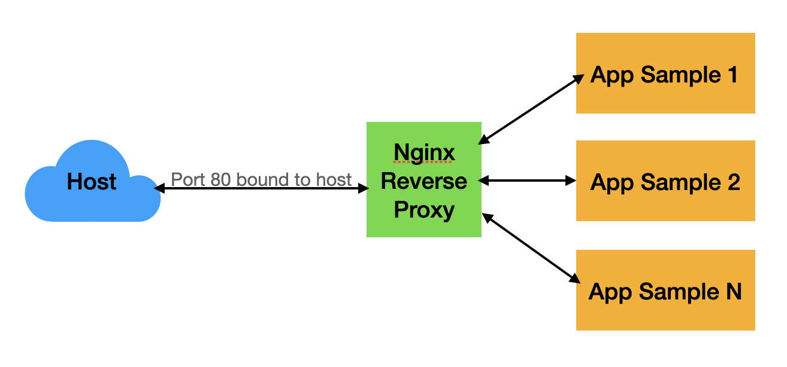

# Nginx as a Reverse Proxy

## Introduction

A reverse proxy is a server that sits between internal applications and external clients, forwarding client requests to the appropriate server. Because NGINX has a number of advanced load balancing, security, and acceleration features that most specialized applications lack, using NGINX as a reverse proxy enables us to add these features to any application.

<p align="center">
    
</p>

## The Setup

Each application sample project be a standalone docker compose project with its own `docker-compose.yml` file. For this example have two applications

- app-sample-1
- app-sample-2

The applications don't bind to any external ports, the reverse proxy will handle this for us.

For simplicity these applications return static HTML using a nginx container.

## Using the Reverse Proxy

1. Clone the repository
```
git clone https://github.com/GermanTorresM/nginx-proxy.git
cd nginx-proxy
```

2. Create network
```
docker network create curramba-network
```

3. Start each of the application sample first:
```
cd app-sample-1
docker-compose up -d
```
Repeat for each application sample needed in your project.

4. Edit `nginx.conf` and replace the string `${SERVER_NAME}` with Docker host machine's hostname. You can find it from the command line by executing the command "hostname" or localhost.

Before
```
server {
			
			listen 443 ssl;
    		# Replace ${SERVER_NAME} with name obtained from console command output: "hostname"
			#server_name ${SERVER_NAME}; 
```

After
```
server {
			
			listen 443 ssl;
    		# Replace ${SERVER_NAME} with name obtained from console command output: "hostname"
			server_name user-pc
```

5. Generate certificates: It is needed top generate ssl certificates using script `generate-certificate.sh`
```
sh generate-certificates.sh
```

It is needed to set up some variables inside the script.
```
# Set IP and COMMONNAME
export IP="172.22.11.203"
export COMMONNAME="localhost"
```

6. Start the Nginx Proxy:
```
cd ../reverse-proxy
docker-compose up -d
```

7. Add the domains to your /etc/hosts file:
```
echo "192.168.86.100 app-sample-1" >> /etc/hosts
echo "192.168.86.100 app-sample-2" >> /etc/hosts
```
